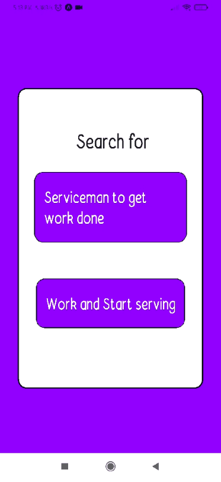
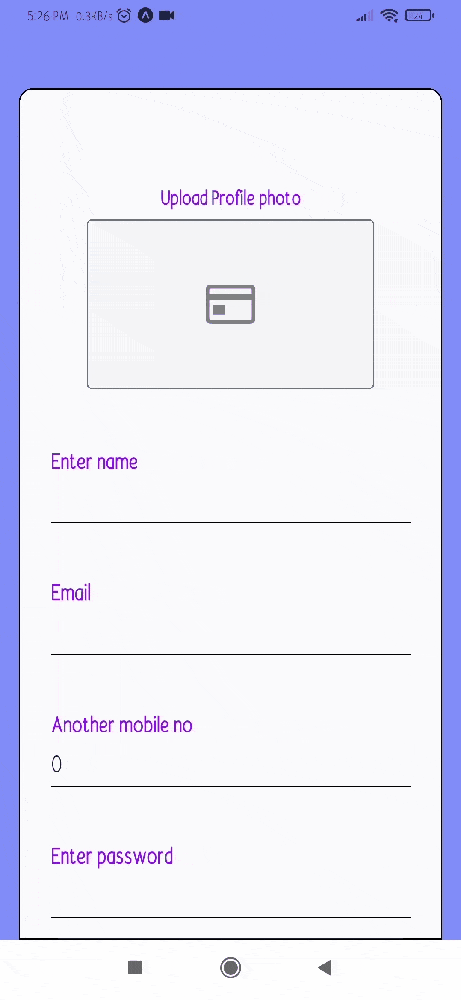

# About
---

Its a React native mobile application.It  get and provide basic work like Electrician, Legal, IT Support ,Housekeeping, Maid ,delivery, etc. in few clicks.

##### - This is single app for both serviceman as well as work provider,the user chooses his role either as serviceman or Work Provider, login and thereafter app divides into 2 branches each has different set of screens, functionality,features and UI for a seamless experince to job seeker and job provider.

### - Beside basic functionality like login, registering verification ->i have integrated functionalities like Google map for live location detaction for both client and Servicemanneardy by registering and computing latitude and longitude ,Push notifications. App linking enables animations, Calling through app, mesaaging , camera for face verification and various feature to choose domain ,read reviews,set a deal,Post reviews , If not satisfied with quality, raise a report. Etc
  

---
## App Demo:-  https://www.youtube.com/watch?v=aN1QZVn3QZw&ab_channel=PriyankGupta

---
---

## Tech used

- React Native 
- Redux toolkit
- Tailwind Css  - native base
- react-navigation/native
- axios
- expo 
    - Animations
    - Linking 
    - location 
    -sms 
    -status-bar
- formik
- yup
- react-native-maps-directions

### Demo Screens
 

---

